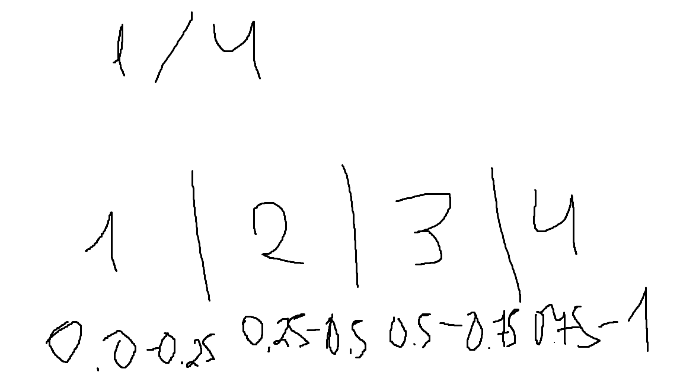
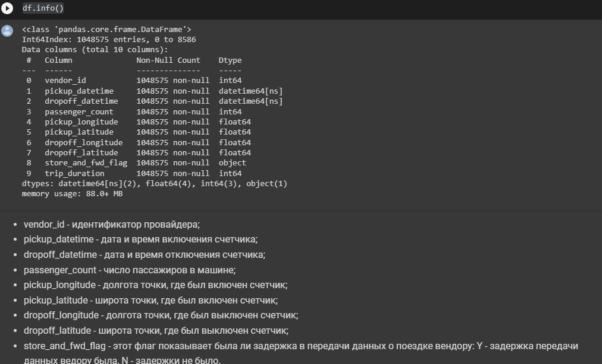
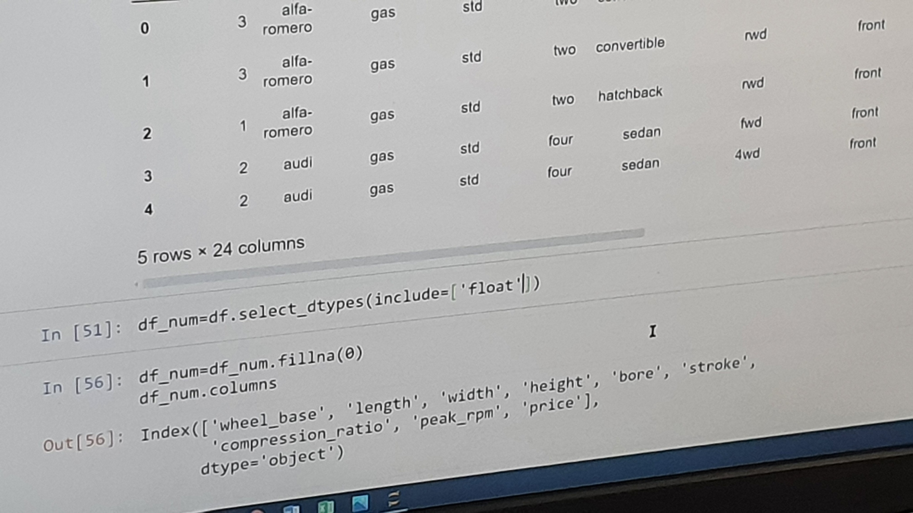

# bigduta
удачи всем моим подписчикам

зачем %matplotlib inline:  https://pythonguides.com/what-is-matplotlib-inline/
</br>
плотность распределения: 
https://habr.com/ru/post/587372/
и
https://ru.stackoverflow.com/questions/791507/%D0%9F%D0%BE%D1%81%D1%82%D1%80%D0%BE%D0%B8%D1%82%D1%8C-%D0%BF%D0%BB%D0%BE%D1%82%D0%BD%D0%BE%D1%81%D1%82%D1%8C-%D1%80%D0%B0%D1%81%D0%BF%D1%80%D0%B5%D0%B4%D0%B5%D0%BB%D0%B5%D0%BD%D0%B8%D1%8F-%D0%B8%D0%B7-%D0%B4%D0%B8%D1%81%D0%BA%D1%80%D0%B5%D1%82%D0%BD%D1%8B%D1%85-%D0%B4%D0%B0%D0%BD%D0%BD%D1%8B%D1%85-%D0%B7%D0%BD%D0%B0%D1%8F-%D0%B3%D0%B8%D1%81%D1%82%D0%BE%D0%B3%D1%80%D0%B0%D0%BC%D0%BC%D1%83

Вообще огонь - тут прям всё про heatmap и его аналоги расписано: https://proglib.io/p/feature-selector

Тут что-то есть про корреляцию на случай если...: 
</br>
https://habr.com/ru/post/557998/ 
</br>
или
</br>
https://www.brutalk.com/ru/brutalk-blog/view/kak-rasschitat-korrelyaciyu-mezhdu-peremennymi-v-python-60470c8a11ff3
</br>
или
</br>
https://chel-center.ru/python-yfc/2020/02/13/opisatelnaya-statistika-na-python-chast-2/
</br>
или
</br>
https://www.delftstack.com/ru/howto/seaborn/correlation-heatplot-seaborn-python/
</br>
ИЛИ ЖЕ НАЙТИ ТУТ: https://habr.com/ru/company/ods/blog/323210/
</br>
</br>
Модель визуализации (2.2) должна быть например такая (минимум 3 шт.):
```
sns.set(rc={'figure.figsize':(15,10)})
df.plot(x='date',y='new_cases')
```
То есть тут идет оценка между двумя столбиками....

https://habr.com/ru/post/468295/
https://www.python-graph-gallery.com/33-control-colors-of-boxplot-seaborn
https://www.geeksforgeeks.org/boxplot-using-seaborn-in-python/?ref=lbp
https://pythobyte.com/density-plots-in-python-8f3b4f9b/

# BigDataTrips
Короче кто прочитает тот сдохнет
```
import pandas as pd #- TODO
import numpy as np #- TODO
from pprint import pprint #- TODO
import glob # для обнаружение файлов в папках: https://docs.python.org/3/library/glob.html
import codecs # либа с реестром кодеков: https://docs.python.org/3/library/codecs.html
import json # Джейсон Хуанг
import seaborn as sns # чтобы можно было построить много картинок: https://seaborn.pydata.org/
import matplotlib.pyplot as plt #- TODO
pd.set_option('display.max_columns', None) # Зачем отключать я не знаю
```

https://habr.com/ru/company/ods/blog/322626/
amazing rp бесплатный мультиплеер гта сан андреас скачивай бесплатно
https://nagornyy.me/it/modeli-klassifikatsii-v-python/

```
# корреляции штуки привередливые
# https://matplotlib.org/2.0.2/examples/color/colormaps_reference.html
corr=df.drop(['id'], axis=1).corr()
plt.figure(figsize=(12, 12))

heatmap = sns.heatmap(corr, vmin=-1, vmax=1, annot=True, cmap= 'coolwarm') # цвета поищем...
heatmap.set_title('Оаоаоаооа мммм', fontdict={'fontsize':30}, pad=20)
```

```
#StandardScaler
scaler = StandardScaler()
x=df[['Признаки самые такие', 'Четкие да']]
y=df['Второй зачем']
```
```
#Начинаем интенсивную тренировку рук и ног
X_train, X_test, y_train, y_test = train_test_split(X, y, test_size=0.33, random_state=42, stratify=y)
```
```
#Обучение на основе AMAZING RP ЛУЧШИЙ СЕРВЕР
```
```
df.to_csv('что за замечательные данные.csv', encoding='utf-8-sig', index=False)
```
```
# Виктор КорнеPLOT
# С фигуркой подумац Geometry Dash (2.2) WHEN
sns.set(rc={'figure.figsize':(15,10)})
df.plot(x='date',y='new_cases')
```
```
# Забираем самые четкие видимо
df_BEST=df[(df['Поляна']>0.7) & (df['Поляна']<=0.95)]
```


# На этом оффтоп закончен


```
#импортирование библиотек
import numpy as np
import matploltlib.pyplot as plt
import seaborn as sns
import pandas as pd
%matplotlib inline
```
```
#1.1. загрузка данных 
df = pd.read_excel('path.xlsx')
df = pd.read_json('path.json')
```
```
#объединение дата фреймов
#https://pandas.pydata.org/pandas-docs/stable/reference/api/pandas.DataFrame.drop_duplicates.html/df.drop('dropoff_datetime', axis=1, inplace=True) - дублирующиеся столбцы
#можно юзать всё вместе
df = pd.concat([df1, df2])
df = pd.drop__duplicates('column_name')
df = pd.drop('column_name', axis=1)
```
```
#приведение типов
#https://qastack.ru/programming/15891038/change-data-type-of-columns-in-pandas
df['column_name']=pd.to_datetime(df['column_name'])
```

```
#узнаем кол-во NaN-ов
df.isna().sum()
#выбросы и всякая штука
df.describe()

#перевод секунд в минуты, и после перевода опять сделать describe()
df.trip_duration = df.trip_duration.apply(lambda x: x/60)

#для более лучшего просмотра выбросов использовать boxplot
sns.boxplot(df['column_name'])
#очистка выбросов происходит за счёт подбора подходящих значения на boxplot
qunt = df['column_name'].quantile(0.9248)
df = df[df['column_name'] < qunt]
sns.boxplot(df['column_name'], palette = 'Blues_r')
plt.show()
```

```
# 1.2. df = pd.read_csv('name.csv'). 
name.info()
#просмотр данных, хранящихся в столбцах
for col in ['column_name', 'column_name', 'column_name']:
    print(weather[col].unique())
    print('-' * 10)
```

```
#замена неверных значений на "0" и конвертирование в другой тип данных
for col in ['precipitation', 'snow fall', 'snow depth']:
    weather.loc[weather[col] == 'T', col] = 0
    weather[col] = weather[col].astype(np.float64)
```

```
#просмотр выбросов
weather.describe()
#конвертирование из F в C
for temp in ['maximum temperature', 'minimum temperature','average temperature']:
    weather[temp] = weather[temp].apply(lambda x: (x-32)/1.8)
```

```
#Объединение поездок и погоды
#у нас в данных о поездках нету столбца date, мы добавим его временно, данные о годе, месяце и т.д. 
#возьмем из даты посадки. После объединения удалим столбец date и столбец с датой высадки
df['d'] = df['p.up_d.t.'].apply(lambda x: str(x.day) + '-' + str(x.month) + '-' + str(x.year))
df = df.merge(weather, on='d').drop(['d'], axis=1)
```

```
#добавление признаков кароче эту штуку надо сделать на каждый property
df['date_property(year\month\day\hour\minute)'] = df['dropoff_datetime'].apply(lambda x: x.year)
#dropoff_datetime можно удалить
```

```
#создание нового столбца для задания 
df['new_column']=df['old_column']
df.info()
```


```
# что такое квартиль? картинку чекни
# здесь короче у нас есть хрень с 0.25, потом нужно скопировать строку и написать 0.5, потом 0.75
# q2=df.category_travel_time.quantile(0.5) 
q1=df.category_travel_time.quantile(0.25)

# для q1 и q4 просто <= 0.25 и >= 0.75. То есть вот & юзать не надо
df.category_travel_time=np.where(((df.category_travel_time<q2)&(df.category_travel_time>q1)),2,df.category_travel_time)
# old_column можно удалить по причине его ненужности
```

```
#1.3 узнаем кол-во NaN-ов, плотность
new_csv.isna().sum()
df.info()
#для расшифровки и назначения чекни скрин
```
```
#1.3 узнаем кол-во NaN-ов, плотность
new_csv.isna().sum()
df.info()
#для расшифровки и назначения чекни скрин
```
```
#1.4 выбросы и всякая штука
df.describe()

#перевод секунд в минуты, и после перевода опять сделать describe()
df.trip_duration = df.trip_duration.apply(lambda x: x/60)

#для более лучшего просмотра выбросов использовать boxplot
sns.boxplot(df['column_name'])
```
```
#очистка выбросов происходит за счёт подбора подходящих значения на boxplot
qunt = df['column_name'].quantile(0.9248)
df = df[df['column_name'] < qunt]
sns.boxplot(df['column_name'], palette = 'Blues_r')
plt.show()
```
```
#1.5 сохраняет в директорию, где лежит Report_C1.ipynb
df.to_csv('C1_result.csv', index=False)
#Вывод: во время первой сессии были сделаны следующие вещи:
#1.обработаны пропуски во всех данных
#2.обработаны выбросы во всех данных
#3.данные приведены к приемлимому виду(отформатированы)
#4.объединены данные о всех поездках и о погоде в эти дни в один датасет и сохранены с расширением .csv
```




# Визуализация зависимостей данных
```
# чтение файла с обработанными данными
df = pd.read_csv('result.csv')
# убедимся, что данные отображаются верно
df.head()
```
```
# убедимся, что данные корректные
df.info()
```
```
#Преобразуем тип данных столбца category_travel_time для дальнейшего обучения модели
# препобразование переменной в тип "Категории"
df['category_name'] = df['category_name'].astype('category')
```
```
## Корреляция
может быть и выше понадобится
если много данных - то надо разделить их как никак...
```
```
# определение коррелирующих моделей
# тепловая матрица корреляции
plt.figure(figsize=(15, 10))

sns.heatmap(df.corr(), annot=True)
```
```
# удаление коллинеарных признаков
df.drop(['максимум такая temperature','минимум такая например temperature'], axis=1, inplace=True)
```
```
## Графики зависимостей аттрибутов на целевую переменную
```
```
# отображение графика зависимостей
sns.countplot(x='passenger_count', data = df, hue = 'category_travel_time')
```
```
#ещё график
#%config InlineBackend.figure_format = 'png'
sns.pairplot(df, hue="category_travel_time")
```
```
sns.set(rc={'figure.figsize':(15,10)})
df.plot(x='category_travel_time', y='passenger_count')
# или например по другой переменной
# df.plot(x='category_travel_time',y='passenger_count') - 
```
```
# Разбиение набора данных
```
```
# зачем удалять так и не понимаю
df = df.drop(['pickup_datetime', 'pickup_latitude','pickup_longitude', 'dropoff_longitude','dropoff_latitude'], axis = 1)
```
```
# определение что у нас выступает одним и другим (для Y лучше всего идут категориальные признаки, а в X - числовые)
X = df.drop(['category_travel_time'], axis = 1)
y = df['category_travel_time']
```
```
# импорт тестирования модели
from sklearn.model_selection import train_test_split
```
```
Разобъём набор данных на 1/5. Данная выборка является наиболее оптимальной, поскольку абсолютное большинство данных должно находится при обучении модели, чтобы получить наиболее оптимизированную модель со стороны её точности.

или

Разделим данные на тестовые и обучающую выборки, в соотношении 80 на 20, так как данных достаточно и после удаления их - образовываться аномалии при обучении не будут. А также, чтобы уменьшить время обучение модели, т.к. при больших объемах данных - затрачивается много времени.
```
```
# инициализация переменных
X_train, X_test, y_train, y_test = train_test_split(X, y, test_size=0.2, random_state=0)
```
```
# Классификация исходных компетенций (Классификация хфлвфлфжыдвлфжывл)
```
```
Были выбраны 3 метода, такие как: Логистическая Регрессия, k Ближайших Соседей и множество деревьев. Эти методы были выбраны, так как они относятся к числу распространенных методов решения задачи классификации. (Ну или иначе как то обозвать это дело)

// или

## 2.3 Классификация 

Рассмотрим несколько моделей классификации
### KNeighborsClassifier
Классификация на основе соседей - это тип обучения на основе экземпляров или необобщающего обучения: он не пытается построить общую внутреннюю модель, а просто сохраняет экземпляры обучающих данных. Классификация вычисляется простым большинством голосов ближайших соседей каждой точки: точке запроса назначается класс данных, который имеет наибольшее количество представителей среди ближайших соседей точки.

### RandomForestClassifier
Случайный лес — это метаоценка, которая соответствует ряду классификаторов дерева решений для различных подвыборок набора данных и использует усреднение для повышения точности прогнозирования и контроля переобучения. Размер подвыборки управляется параметром max_samples, если bootstrap=True (по умолчанию), в противном случае для построения каждого дерева используется весь набор данных
### GaussianNB
Наи́вный ба́йесовский классифика́тор — простой вероятностный классификатор, основанный на применении теоремы Байеса со строгими (наивными) предположениями о независимости. В зависимости от точной природы вероятностной модели, наивные байесовские классификаторы могут обучаться очень эффективно

### Деревья решений
В основе популярных алгоритмов построения дерева решений лежит принцип жадной максимизации прироста информации – на каждом шаге выбирается тот признак, при разделении по которому прирост информации оказывается наибольшим. Дальше процедура повторяется рекурсивно, пока энтропия не окажется равной нулю или какой-то малой величине (если дерево не подгоняется идеально под обучающую выборку во избежание переобучения).

### Нелинейная классификация
НЕ ЗНАЮ ЧТО МОЖНО ОПИСАТЬ

### Машина опорных векторов
Основная идея метода — перевод исходных векторов в пространство более высокой размерности и поиск разделяющей гиперплоскости с максимальным зазором в этом пространстве. Две параллельных гиперплоскости строятся по обеим сторонам гиперплоскости, разделяющей классы. Разделяющей гиперплоскостью будет гиперплоскость, максимизирующая расстояние до двух параллельных гиперплоскостей. Алгоритм работает в предположении, что чем больше разница или расстояние между этими параллельными гиперплоскостями, тем меньше будет средняя ошибка классификатора.

## Матрикики
Рассмотрим две метрикики для оценивания модели классификации

### accuracy f1-score
Это гармоническое среднее значений точности и полноты. Возьмём её, потому что она дает лучшую оценку неправильно классифицированных случаев

### macro avg f1-score

macro avg f1-score пожалуй, самый простой из многочисленных методов усреднения. Макроусредненная оценка F1 (или макрооценка F1) вычисляется путем взятия среднего арифметического (также известного как невзвешенное среднее) всех оценок F1 для каждого класса. Этот метод будет взят, поскольку он обрабатывает все классы одинаково, независимо от их значений поддержки
```
```
# импорт обучаемых методов
from sklearn.neighbors import KNeighborsClassifier
from sklearn.linear_model import LogisticRegression
from sklearn.ensemble import RandomForestClassifier

#Импорт моделей
from sklearn.metrics import classification_report
from sklearn.naive_bayes import GaussianNB

import pandas as pd
import seaborn as sns
from sklearn.model_selection import train_test_split
from sklearn.preprocessing import StandardScaler, LabelEncoder
from sklearn.svm import SVC
from sklearn import datasets
import numpy as np
import matplotlib.pyplot as plt
import seaborn as sns
```
```
#Обучение
neigh = KNeighborsClassifier(n_neighbors=3)
neigh.fit(X_train, y_train)
preds=neigh.predict(X_test)
print(classification_report(preds, y_test))
```
```
#Обучение
rfc = RandomForestClassifier()
rfc.fit(X_train, y_train)
rfc_preds=rfc.predict(X_test)
print(classification_report(rfc_preds, y_test))
```
```
#Обучение
gnb = GaussianNB()
gnb.fit(X_train, y_train)
gnb_preds=gnb.predict(X_test)
print(classification_report(gnb_preds, y_test))
```
```
# Нелинейная классификация
# Обучение
svm_rbf = SVC(kernel='rbf', random_state=1, gamma=0.10, C=10.0)
svm_rbf.fit(X_train, y_train)
y_pred_svm_rbf = svm_rbf.predict(X_test)
print(classification_report(y_test, y_pred_svm_rbf))
```
```
# Деревья решений
# Обучение
from sklearn.tree import DecisionTreeClassifier

tree = DecisionTreeClassifier(criterion='gini', 
                              max_depth=4, 
                              random_state=1)
tree.fit(X_train, y_train)
y_pred_tree = tree.predict(X_test)
print(classification_report(y_test, y_pred_tree))
```
```
#Машина опорных векторов
#Обучение
from sklearn.svm import SVC

svm = SVC(kernel='linear', C=1.0, random_state=1)
svm.fit(X_train, y_train)

y_pred_svm = svm.predict(X_test)
print(classification_report(y_test, y_pred_svm))
```
```
# Обучение моделей (Можно иначе произвести данное деяние, например вот так)
```
```
Обучим выбранные модели, затем оценим их качество и выберем лучшую. (Сначала метод fit)
```
```
%%time
lr.fit(X_train, y_train)
```
```
%%time
knn.fit(X_train, y_train)
```
```
%%time
rfc.fit(X_train, y_train)
```
```
Прогнозирование (потом для всех методов используем predict)
```
```
lr_pred = lr.predict(X_test)
```
```
rfc_pred = rfc.predict(X_test)
```
```
# Оценка качества моделей 
Для оценки качества модели выберем метрики: аккуратность и отчёт классификации
(в финале уже делаем для всех моделей classification_report)
```
```
#загрузка метрик
from sklearn.metrics import classification_report
from sklearn.metrics import accuracy_score
```
```
Отчёт о классификации
```
```
# отчет классификации
print(classification_report(y_test, lr_pred))
```
```
# отчет классификации
print(classification_report(y_test, knn_pred))
```
```
Две модели могут внезапно показать одниаковую точность, поэтому оценить точность отдельно можно вот таким образом.
```
```
# оценка точности данного метода
print(accuracy_score(lr_pred, y_test))
```
```
# оценка точности данного метода
print(accuracy_score(knn_pred, y_test))
```
```
Наилучшее качество показала модель такая-то, например это может быть - RandomForestClassifier
```
```
## 3.4 Feature Engineering

Преобразуем набор данных путём генерации новых данных с целью повышения точности классификатора и использование StandardScaler
```
```
#Генерация данных (Нужно сформировать данные типа будущие, обычно меняют значение даты там на другое и всё....)
result = pd.merge(df, 
                  df.groupby(['vehicles.brand']).size().sort_values().to_frame(), 
                  on='vehicles.brand')

result.rename(columns={0: 'vehicles_brand_count'}, inplace=True)
df = result
```
```
from sklearn.preprocessing import StandardScaler
```
```
#Преобразщование с помощью StandardScaler
scaler = StandardScaler()
X=df[['dead_count', 
      'injured_count', 
      'participants_count', 
      'vehicles_brand_count']]
y=df['severity']

#Получение выборок
X_train, X_test, y_train, y_test = train_test_split(X, y, test_size=0.33, random_state=42, stratify=y)

#Обучение
randomForestClassifier = RandomForestClassifier()
randomForestClassifier.fit(X_train, y_train)
rfcPredicted=randomForestClassifier.predict(X_test)
print(classification_report(rfcPredicted, y_test))
```
```
## Выводы по Feature Engineering 
На основе результатов выше, можно сделать вывод, что преобразование данных для Feature Engineering привело (или же не привёло) к улучшению модели.
```

```
## Мистер отчёт конспект как дела
* 2.1 ...
* 2.3 ...
* 2.4 ...
* 2.5 ...
```
```
# Сохранение данных
df.to_csv('result.csv', encoding='utf-8-sig', index=False)
```
